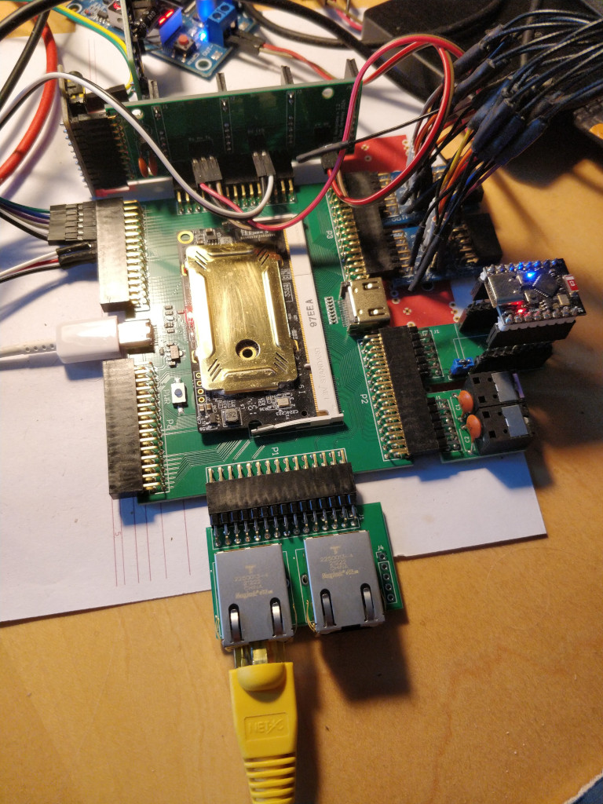

ColorLight Ethernet Interface
====

This PCB provides the RJ45 and magnetics to connect a pair of Ethernet sockets to the 
[Colorlight i9](https://github.com/wuxx/Colorlight-FPGA-Projects/blob/master/colorlight_i9_v7.2.md)
FPGA dev board.

I'm using the excellent [LiteX](https://github.com/enjoy-digital/litex) SoC builder from [Enjoy Digital](http://www.enjoy-digital.fr/).

This uses the 
[liteeth](https://github.com/enjoy-digital/liteeth)
library to create the MAC and interface to the PHY.

The dev board contains a pair of Broadcom 
[B50612D](https://github.com/wuxx/Colorlight-FPGA-Projects/blob/master/doc/B50612D-datasheet.pdf)
Gigabit Ethernet Transceivers.

The project was inspired by this [Ethernet interface](https://github.com/kazkojima/colorlight-i5-tips#ethernet) by kazkojima.

I found an 
[RJ45 connecter](https://www.digikey.co.uk/en/products/detail/trp-connector-b-v/2250013-4/9451594)
with built in magnetics, which makes the whole design a lot simpler.

I've got the system loading a binary image over TFTP and booting. I've not yet had time to do any more tests.

            __   _ __      _  __
           / /  (_) /____ | |/_/
          / /__/ / __/ -_)>  <
         /____/_/\__/\__/_/|_|
       Build your hardware, easily!

     (c) Copyright 2012-2024 Enjoy-Digital
     (c) Copyright 2007-2015 M-Labs

     BIOS built on Oct 19 2024 10:06:09
     BIOS CRC passed (bfabfcc0)

     LiteX git sha1: a59b67e4

    --=============== SoC ==================--
    CPU:            VexRiscv_LinuxDebug @ 50MHz
    BUS:            wishbone 32-bit @ 4GiB
    CSR:            32-bit data
    ROM:            128.0KiB
    SRAM:           8.0KiB
    L2:             8.0KiB
    FLASH:          8.0MiB
    SDRAM:          8.0MiB 32-bit @ 50MT/s (CL-2 CWL-2)
    MAIN-RAM:       8.0MiB

    --========== Initialization ============--
    Ethernet init...
    Initializing SDRAM @0x40000000...
    Switching SDRAM to software control.
    Switching SDRAM to hardware control.
    Memtest at 0x40000000 (2.0MiB)...
      Write: 0x40000000-0x40200000 2.0MiB     
       Read: 0x40000000-0x40200000 2.0MiB     
    Memtest OK
    Memspeed at 0x40000000 (Sequential, 2.0MiB)...
      Write speed: 18.4MiB/s
       Read speed: 25.3MiB/s

    Initializing w25q64 SPI Flash @0x00800000...
    SPI Flash clk configured to 25 MHz
    Memspeed at 0x800000 (Sequential, 4.0KiB)...
       Read speed: 2.3MiB/s
    Memspeed at 0x800000 (Random, 4.0KiB)...
       Read speed: 1.0MiB/s

    --============== Boot ==================--
    Booting from serial...
    Press Q or ESC to abort boot completely.
    sL5DdSMmkekro
                 Timeout
    Booting from flash...
    Error: Invalid image length 0xacc0d000
    Booting from network...
    Local IP: 192.168.0.249
    Remote IP: 192.168.0.189
    Booting from boot.json...
    Copying app.bin to 0x40000000... (109760 bytes)
    Executing booted program at 0x40000000

    --============= Liftoff! ===============--
     ____                   _  ___  ____  
    |  _ \ __ _ _ __   __ _| |/ _ \/ ___| 
    | |_) / _` | '_ \ / _` | | | | \___ \ 
    |  __/ (_| | | | | (_| | | |_| |___) |
    |_|   \__,_|_| |_|\__, |_|\___/|____/ 
                      |___/               

    LiteX/PanglOS. Built Oct 19 2024 09:49:13

    1049893 main DEBUG main.cpp +641 app_main() : 

